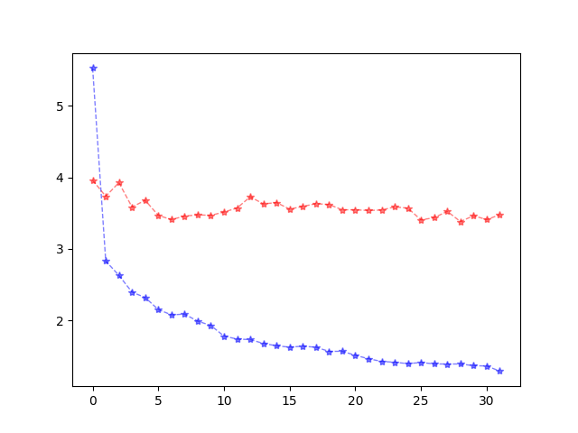

# torch-hmsmnet
📋  HMSMNet implemented in Torch


## Requirements

To install requirements:

```setup
pip install -r requirements.txt
```

>other versions of packages may work as well
## Dataset preparation ：
Use WHU-Stereo Dataset please download: 
```
This work is done by the team of Prof. Wanshou Jiang in State Key Laboratory of Information Engineering in Surveying, Mapping and Remote Sensing, Wuhan University, Wuhan, China. Please see: http://openrs.whu.edu.cn/md/members/jws/jws.html.

Links
The dataset can be downloaded from:

Baidu drive: https://pan.baidu.com/s/1SF2RRIRJeP8TbKMoDSL0OQ?pwd=xbyx

or

Google drive: https://drive.google.com/drive/folders/1mw6PrPRidDxP1OtS3_fgblv4T5x44I_k
```
Use US3D-Track2 Dataset please download :(Only Track2 is needed)
```
https://ieee-dataport.org/open-access/data-fusion-contest-2019-dfc2019
```
Prepare the steps following:

<1> download dataset you need

<2> Place dataset in the right place:for whu-stereo, only withgroundtruth is needed(supervised training style), place withgroundtruth folder under workspace(i.e. torch-hmsmnet)

for us3d-track2, place Track2-RGB-ALL and Track2-Truth under workspace(i.e. torch-hmsmnet) and rename them by track2-data and track2-truth.(following my filename.txt) 

<3> If you use your own filename, you need to generate filename.txt.

filename.txt follows simple style as [leftimage name]   [4*space] [rightimage name] [4*space]   [groundtruth disparity name]

## Dataloader :
Preprocessing follows normalization skill using mean and std of single image.

## Training 

To train the model(s) in the paper, run this command:

```train
sh ./scripts/train.sh
```
Note: The users are advised to modify parameters according to the actual situation.
The disparity range is **NOT** defined by scripts and need to be define in **train.py** as it's not symmetrical.
## Evaluation

To evaluate 

```eval
sh ./scripts/test.sh
```
Note: The users are advised to modify parameters according to the actual situation.
The disparity range is **NOT** defined by scripts and need to be define in **test.py** as it's not symmetrical.

## Pre-trained Models 

You can download pretrained models here:(US3D Track2 pretrained model)

- [US3D pretrained model](https://drive.google.com/drive/folders/1m4hJqbsvYB6TiT6Fv1BefBaKRj6ISMzX?usp=drive_link) trained on US3D-Track2 using trainset as ./filenames/igarss_train.txt and valset as ./filenames/igarss_val.txt. DIsparity range -96,96.

- [whu pretrained model](https://drive.google.com/drive/folders/1ngdQMEcId7sk9bAnBn7r0tEtXQ-U6b1D?usp=drive_link) trained on WHU-Stereo  using trainset as ./filenames/train_whu_dis.txt and valset as ./filenames/val_whu_dis.txt, same as author of HMSMNet claimed. Disparity range -128, 64. Learning rate follows statement in HMSMNet(https://www.sciencedirect.com/science/article/abs/pii/S092427162200123X)

After downloading, put it under checkpoints folder and change pathname in scripts depending on your demand.
## Results

- Trainset EPE and Valset EPE for US3D Track2 during training:
- 
- Trainset EPE and Valset EPE for WHU-Stereo during training:
- 
| Model name         | Testset EPE  | Testset D1(%) |
| ------------------ |---------------- | -------------- |
|   WHU Model                 |      2.8880           |           29.13     |


## Please Cite ：

>📋  This is a work reproducing HMSMNet, original code in Tensorflow style (https://github.com/Sheng029/HMSM-Net)
>  If you find this repo useful, please STAR and cite:
>  @article{HE2022314,
title = {HMSM-Net: Hierarchical multi-scale matching network for disparity estimation of high-resolution satellite stereo images},
journal = {ISPRS Journal of Photogrammetry and Remote Sensing},
volume = {188},
pages = {314-330},
year = {2022},
issn = {0924-2716},
doi = {https://doi.org/10.1016/j.isprsjprs.2022.04.020},
url = {https://www.sciencedirect.com/science/article/pii/S092427162200123X},
}
